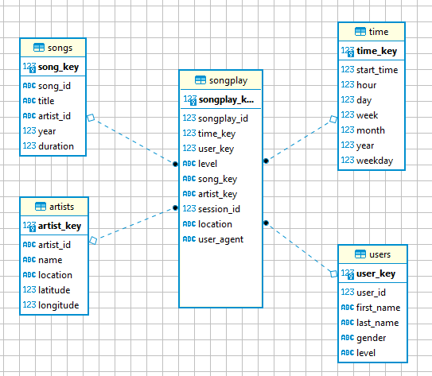

# Data Warehouse in AWS Redshift

## Purpose/Goals

This project is used as an exercise to verify the concepts learned in the third module of the Data Engineering Nanodegree on Udacity.

*Sparkify* is a music app with a Redshift database underneath to collect data related to songs listened and respective event logs.
A star schema data model for *sparkifydb* database has been implemented conceptually with the definition of fact and dimension tables.

The ETL pipeline extracts the information from JSON files hosted on S3 buckets and prepare the data via Python before it is imported inside the
database.

## Schema design



### Main design

The databse `sparkifydb` holds information about songs played and relative metadata. The star schema is made of:

 - *fact table*: `songplay`
 - *dimension tables*: `song`, `user`, `time` and `artist`
 
The creation/deletion of tables is done via the `create_tables.py` script, based on the `sql_queries.py` script.
The script has `CREATE TABLE`, `DROP TABLE` statements to create and remove tables from the Redshift database.
`INSERT INTO` statements are used to populated specificaly fact and dimension tables, while `COPY` statements are used to move the data from S3 buckets to staging tables.

This will translate in better performances during data upload to the system.

Fact and dimension tables have also explicit definition of `sortkey` or a `distkey` columns to optimize query performances.

The ETL pipeline reads files inside the S3 buckets:
 - for song data
 - for log data

All files are in JSON format and these are manipulated via the `etl.py` script by using Pandas, a popular library for data manipulation for Python.

## How to run the project

1. On console run `python create_tables.py`. Database and empty tables should be ready.
2. After that run `python etl.py` to populate the tables with song and log data.

## Query examples

Query to check the number of songs listened by gender and level:

```
SELECT user.gender, user.level, sum(songplay.song_id) AS num_songs
FROM songplay JOIN user ON (songplay.user_id=user.user_id)
GROUP BY (user.gender, user.level);
```

Query the average length of the longest 25 songs played per artist:

```
SELECT artist.artist_name, AVG(song.duration) AS avg_duration
FROM songplay JOIN artist ON (songplay.artist_id=artist.artist_id)
              JOIN song ON (songplay.song_id = song.song_id)
GROUP BY artist.artist_name
ORDER BY avg_duration
LIMIT 25;
```

Query to set up a CUBE on the amount of total songs played by year, artist from the Northern/Southern emisphere  and user gender:

```
SELECT main.year, main.artist_emisphere, main.gender, SUM(main.song_id) AS num_songs
FROM
    (SELECT song.year, 
           CASE WHEN artist.latitude>0 THEN 'Northern' else 'Southern' END AS artist_emisphere,
           user.gender,
           songplay.song_id
    FROM songplay JOIN song ON (songplay.song_id=song.song_id)
                  JOIN artist ON (songplay.artist_id=artist.artist_id)
                  JOIN user ON (songplay.user_id=user.user_id)) AS main
GROUP BY CUBE (main.year, main.artist_emisphere, main.gender);
```
 
 
## Files in the repo

Important files inthe repository are:

- `create_tables.py`: coordinate the creation/removal of tables.
- `sql_queries.py`: DML and DLL SQL commands are stored here.
- `etl.py`: coordinate the movement of data from S3 bucket to staging, and from staging to OLAP star schema.
- `requirements.txt`: holds the requirements to launch a virtual environment.
- `img`: contains the PNG of the star schema.
- `dwh.cfg`: contains configuration parameters for AWS.
